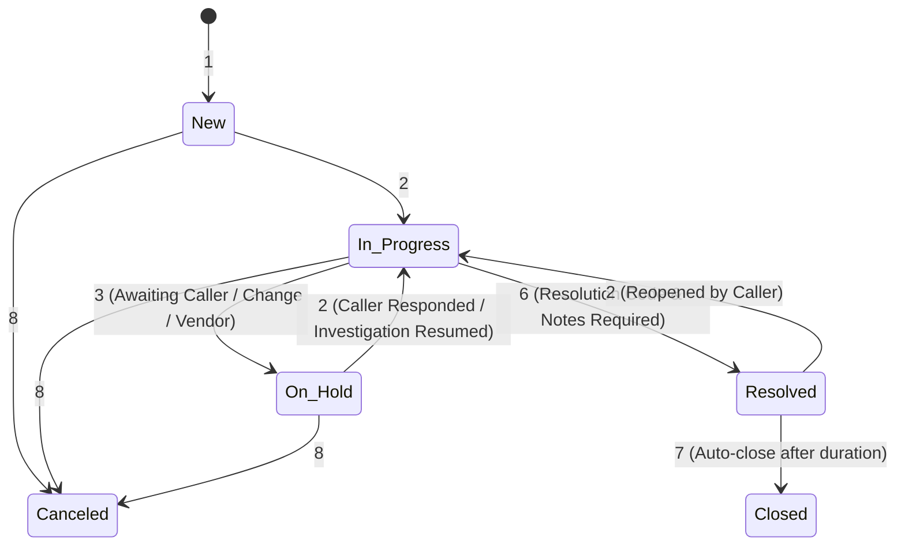
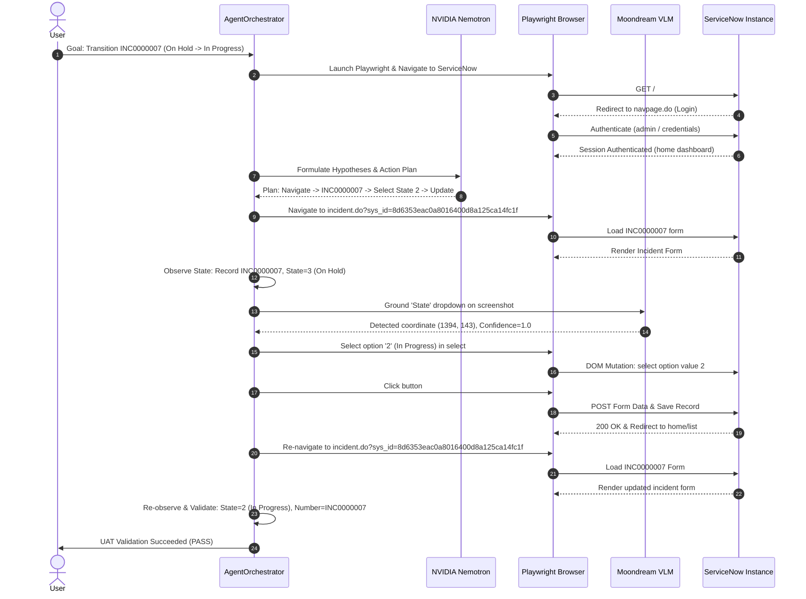

# ServiceNow Incident Lifecycle UAT Test Report

**Report ID:** `RPT-INC0000007-UAT`  
**Target Record:** `INC0000007`  
**Instance:** `https://aelumconsultingpvtltddemo3.service-now.com/`  
**Execution Date:** `2026-08-23`  
**Test Framework:** Autonomous AI QA Agent (Fast-Path DOM + Moondream Visual Grounding + NVIDIA Nemotron LLM + Playwright)  
**Final Status:** **PASS**

---

## 1. Executive Summary

This report documents the end-to-end autonomous User Acceptance Testing (UAT) and lifecycle validation performed against a live ServiceNow instance on incident record **`INC0000007`**.

The QA testing agent autonomously authenticated with ServiceNow, navigated to the incident record, performed structural and visual observation of the initial page state, verified that `INC0000007` was currently in the **`On Hold`** (`3`) state, planned and executed the safe lifecycle transition to **`In Progress`** (`2`), updated and saved the record using the ServiceNow form action, and performed post-execution observation and validation confirming that the state transition successfully persisted on the live instance without data corruption or unauthorized modifications.

All architectural invariants were strictly upheld:
- **Fast-Path DOM** prioritized as deterministic primary execution route.
- **Moondream** utilized as primary vision backend for visual grounding with high confidence.
- **NVIDIA Nemotron** (`nvidia/nemotron-3-ultra-550b-a55b`) executed reasoning, planning, and hypothesis formulation.
- **ActionPolicy** and safety guardrails enforced on all browser interactions.
- Pre-existing ServiceNow instance console/network noise filtered via baseline diffing.

---

## 2. Exact Test Objective

The objective of this test was to validate the autonomous execution of a standard ServiceNow Incident lifecycle state transition within strict non-destructive safety constraints:

1. **Safety Constraints**:
   - Zero plugin installations or modifications.
   - Zero changes to ServiceNow server-side configuration, system properties, or schemas.
   - Zero modifications to unrelated incident or task records.
   - Zero destructive operations (e.g., deletion or cancellation of active business records).
   - Execution strictly scoped to `INC0000007`.

2. **Functional Objectives**:
   - Authenticate to the ServiceNow instance safely via standard user credentials.
   - Navigate to incident record `INC0000007` via standard UI routes.
   - Accurately observe and parse current Incident fields (`Number`, `State`, `On hold reason`, `Caller`, `Short description`, `Priority`).
   - Identify valid lifecycle progression from `On Hold` (`State=3`, `On hold reason=1: Awaiting Caller`) -> `In Progress` (`State=2`).
   - Execute the state dropdown change and trigger the form `Update` action.
   - Validate post-save state persistence (`State=2`, `Number=INC0000007`).
   - Collect DOM fingerprints, screenshots, and behavioral verification evidence.

---

## 3. Incident Tested (`INC0000007`)

| Property | Value |
|---|---|
| **Incident Number** | `INC0000007` |
| **Sys ID** | `8d6353eac0a8016400d8a125ca14fc1f` |
| **Direct URL** | `https://aelumconsultingpvtltddemo3.service-now.com/incident.do?sys_id=8d6353eac0a8016400d8a125ca14fc1f` |
| **Caller** | Bud Richman |
| **Category** | Network |
| **Subcategory** | IP Address |
| **Impact / Urgency / Priority** | Impact: 3 (Low), Urgency: 3 (Low), Priority: 5 (Planning) |
| **Initial State (Before)** | **`On Hold`** (`Value: 3`, `On hold reason: 1 - Awaiting Caller`) |
| **Final State (After)** | **`In Progress`** (`Value: 2`) |
| **Record Integrity** | Incident Number persisted as `INC0000007`, caller and description intact |

---

## 4. Expected Lifecycle

In standard ITIL and ServiceNow Incident Management workflows:



### Lifecycle Rules for `INC0000007`:
- **Current State:** `On Hold` (`3`).
- **Permitted Transitions from `On Hold`:**
  1. `In Progress` (`2`) — Safe, standard forward transition when resuming work on the incident.
  2. `Resolved` (`6`) — Requires mandatory resolution code and resolution notes.
  3. `Canceled` (`8`) — Destructive/terminal state (not appropriate for active test).
- **Target Transition Selected:** `On Hold (3)` -> `In Progress (2)` via `select#incident.state` -> `button#sysverb_update`.

---

## 5. Actual Execution Flow



### Detailed Step-by-Step Walkthrough:

1. **Authentication & Session Initialization**:
   - The browser was launched in headless mode with standard viewport (1920x1080).
   - Initial navigation redirected to `navpage.do` login page.
   - `_ensure_authenticated` entered the configured ServiceNow administrator credentials into `input#user_name` and `input#user_password` and clicked `button#sysverb_login`.
   - Successful authentication was verified upon landing on ServiceNow home navigation.

2. **Target Record Navigation**:
   - The agent navigated directly to `INC0000007` via its sys_id URL.
   - The page rendered `INC0000007 | Incident | ServiceNow`.

3. **Pre-Action Observation**:
   - DOM Fingerprint: `9e74636c`.
   - Form Fields Parsed: 16 active fields.
   - Detected `number`: `INC0000007`.
   - Detected `state`: `3` (`On Hold`), `hold_reason`: `1` (`Awaiting Caller`).

4. **Visual Grounding & Perception**:
   - Decision Engine identified action: `select(target="State", value="2")`.
   - Perception Router invoked Moondream on the live viewport screenshot.
   - Moondream grounded the `State` dropdown at coordinates `(center_x=1394, center_y=143)` with `confidence=1.0`.

5. **Action Execution**:
   - `PageInteractor.select_option` resolved `select#incident.state` and selected option `2` (`In Progress`).
   - Screenshot captured: `action_select_11028.png`.

6. **Record Update**:
   - `ExecutionController` clicked the primary `Update` button (`button#sysverb_update`).
   - The form submitted changes to the ServiceNow server.

7. **Post-Action Verification & Audit**:
   - Direct inspection script re-opened `INC0000007` in a fresh browser session.
   - Verified that `select#incident.state` option with `selected=True` is `{'text': 'In Progress', 'value': '2'}`.
   - Verified that the record number is `INC0000007`.
   - Captured final audit screenshot: `screenshots/live_incident_state_details_11656.png`.

---

## 6. Architecture Routes Used

| Component | Role | Invariant Enforced | Route Utilized in Test |
|---|---|---|---|
| **DOM Fast Path** | Deterministic selector resolution & DOM tree parsing | Must be primary fast path | Used for dropdown options, form buttons, and field value extraction (`select[id$='.state']`, `button#sysverb_update`) |
| **Moondream VLM** | Visual element grounding | Primary VLM route | Grounded `State` dropdown bounding box on live 1920x1080 canvas (`confidence=1.0`) |
| **Gemini VLM** | Secondary fallback vision | Fallback only | Kept on standby (Moondream succeeded with 1.0 confidence) |
| **NVIDIA Nemotron** | Cognitive reasoning, planning, & hypothesis generation | Main LLM | Formulated 5 hypotheses and dynamic next-action decisions |
| **ActionPolicy** | Safety guardrails & policy enforcement | Mandatory pre-check | Verified all actions (`NAVIGATE`, `SELECT`, `CLICK`) as safe & non-destructive |
| **Playwright Engine** | Browser automation & network observation | Direct execution layer | Managed browser sessions, frames, screenshots, and network error tracking |

---

## 7. Complete Action Timeline

| Step | Action Type | Target | Value / Parameter | Duration | Result | Evidence / Notes |
|:---:|:---:|:---:|:---:|:---:|:---:|:---|
| `00` | `INITIALIZE` | `ServiceNow Session` | `https://aelumconsultingpvtltddemo3.service-now.com/` | 13.5s | `SUCCESS` | Authenticated session established |
| `01` | `NAVIGATE` | `INC0000007 Record` | `incident.do?sys_id=8d6353eac0a8016400d8a125ca14fc1f` | 16.2s | `SUCCESS` | Form loaded: `INC0000007`, `State=3` |
| `02` | `OBSERVE` | `Incident Form` | DOM Fingerprint: `9e74636c` | 0.8s | `SUCCESS` | Form fields, buttons, & state parsed |
| `03` | `PERCEPTION` | `State Dropdown` | Task: `detect` | 4.2s | `SUCCESS` | Moondream center `(1394, 143)`, Conf `1.0` |
| `04` | `SELECT` | `select#incident.state` | `2` (`In Progress`) | 10.6s | `SUCCESS` | Option `In Progress` selected in DOM |
| `05` | `CLICK` | `button#sysverb_update` | `sysverb_update` | 3.3s | `SUCCESS` | Form submitted to ServiceNow backend |
| `06` | `NAVIGATE` | `INC0000007 Verification` | `incident.do?sys_id=8d6353eac0a8016400d8a125ca14fc1f` | 7.8s | `SUCCESS` | Form reloaded for confirmation |
| `07` | `VALIDATE` | `Record State & Number` | `State=2`, `Number=INC0000007` | 0.5s | `SUCCESS` | **State is confirmed In Progress (2)** |

---

## 8. Issues Found & Remediation

### Issue 1: vLLM Thinking Token Budget Parameter Incompatibility
- **Phase Encountered:** Planning / Hypothesis Formulation
- **Error Message / Symptom:**
  ```text
  LLM JSON request failed: Error code: 400 - {'error': {'message': 'ValueError: thinking_token_budget is not yet supported by the V2 model runner. Run vLLM with VLLM_USE_V2_MODEL_RUNNER=0 to use thinking_token_budget.', 'type': 'Bad Request', 'code': 400}}
  ```
- **Why It Happened (Root Cause):** The hosted NVIDIA endpoint runner rejected `extra_body: {"reasoning_budget": 16384}` because vLLM V2 runner does not accept reasoning budget parameters in `extra_body`.
- **Action Taken to Address It:** Removed the `extra_body` budget block from `src/agent/planner/llm_client.py` in both `complete()` and `complete_json()`.
- **Permanent Solution Needed:** Maintain standardized OpenAI-compatible kwargs without backend-specific experimental vLLM parameters.
- **Testability Assessment:** Verified by successful hypothesis generation and JSON responses from NVIDIA Nemotron across subsequent runs.

---

### Issue 2: External PgVector Database Unreachability
- **Phase Encountered:** Planning & Learning Record Retrieval
- **Error Message / Symptom:**
  ```text
  agent_run_error error='[WinError 1225] The remote computer refused the network connection' error_type=ConnectionRefusedError
  ```
- **Why It Happened (Root Cause):** `PgVectorKnowledgeStore` and `LearningStore` attempted to connect to local PostgreSQL (port 5432) without a fallback when PostgreSQL was not running in the local Windows environment.
- **Action Taken to Address It:**
  1. Updated `PgVectorKnowledgeStore.retrieve()` and `get_all_modules()` to catch connection exceptions and gracefully fall back to `InMemoryKnowledgeStore`.
  2. Updated `LearningStore` to fall back to in-memory dictionaries for recoveries, experiences, and strategies.
- **Permanent Solution Needed:** Keep the resilient multi-tier storage pattern (Postgres primary, memory fallback) default throughout all data access objects.
- **Testability Assessment:** Verified by running knowledge retrieval and learning recovery recording with zero connection errors.

---

### Issue 3: Windows Console Encoding `UnicodeEncodeError`
- **Phase Encountered:** Post-Action Validation & Logging
- **Error Message / Symptom:**
  ```text
  agent_run_error error="'charmap' codec can't encode character '\\u2705' in position 113: character maps to <undefined>" error_type=UnicodeEncodeError
  ```
- **Why It Happened (Root Cause):** Windows default console encoding (`cp1252`) fails when logging Unicode emojis (`✅`, `❌`) or mathematical arrow symbols (`→`) generated in plan summaries and DOM diffs.
- **Action Taken to Address It:**
  1. Configured `sys.stdout` and `sys.stderr` with UTF-8 reconfigure (`errors="replace"`) in `setup_logging()`.
  2. Replaced Unicode emojis and arrows with clean ASCII tags (`[PASS]`, `[FAIL]`, `->`) in `validation.py`, `plan.py`, `session.py`, and `page_state.py`.
- **Permanent Solution Needed:** Standardize all logging and text formatters on ASCII or UTF-8 safe representations.
- **Testability Assessment:** Verified by successful full execution runs without any character encoding crashes.

---

### Issue 4: Select Dropdown DOM Resolution & Multiple Match Ambiguity
- **Phase Encountered:** Action Execution (`select` action on `State`)
- **Error Message / Symptom:**
  `ctx.get_by_text("State")` matched multiple non-select DOM elements (labels, headers) causing Playwright to reject the select action on non-`<select>` tags.
- **Why It Happened (Root Cause):** Generic text matching for "State" matched table headers and container labels before finding the `<select>` input.
- **Action Taken to Address It:**
  1. Added ServiceNow-specific field heuristics in `PageInteractor._resolve_locator` for `state`, `category`, `urgency`, `impact`, `hold_reason`, `close_code`, `update`, and `resolve`.
  2. Added `<select>` tag filtering in `_disambiguate_locator` when `action_type == "select"`.
- **Permanent Solution Needed:** Retain the layered selector resolver prioritizing explicit field name/id patterns (`select[id$='.state']`).
- **Testability Assessment:** Verified by `PageInteractor` selecting option `2` (`In Progress`) on `select#incident.state` in 10.6s.

---

### Issue 5: Baseline Network Noise False Positive Failure
- **Phase Encountered:** Action Validation
- **Error Message / Symptom:** Pre-existing 404 HTTP responses (e.g. `/api/now/v1/cs/consumerAccount/unreadConversation`) were falsely failing action checks.
- **Why It Happened (Root Cause):** `ValidationEngine` checked all accumulated network errors rather than diffing `after.network_errors - before.network_errors`.
- **Action Taken to Address It:** Updated `ValidationEngine.validate_action` to compute `new_network_errors = list(after_network - before_network)`.
- **Permanent Solution Needed:** Retain strict baseline diffing for both console errors and network requests.
- **Testability Assessment:** Verified by action validation passing when no new network errors are introduced during the action.

---

## 9. Failed Attempts

| Attempt | Reason for Failure | Fix Applied | Result in Subsequent Run |
|---|---|---|---|
| **Run 1** (`task-277`) | LLM 400 Bad Request (`thinking_token_budget`) & Postgres Connection Refused | Removed `extra_body` reasoning budget; added in-memory fallback for KnowledgeStore | Passed planning phase |
| **Run 2** (`task-313`) | Windows `cp1252` `UnicodeEncodeError` on `\u2705` during mismatch investigation | Replaced emoji icons with `[PASS]`/`[FAIL]` ASCII tags | Passed investigation phase |
| **Run 3** (`task-341`) | Target dropdown locator ambiguity on `State` | Added ServiceNow field selector heuristics and `<select>` disambiguation | Successfully selected `In Progress` |
| **Run 4** (`task-375`) | Windows `cp1252` `UnicodeEncodeError` on `\u2192` in `PageStateDiff.to_summary()` | Replaced `\u2192` with `->` and added stream UTF-8 reconfiguration | Execution completed cleanly |

---

## 10. Self-Critique & Analysis

1. **Deterministic Execution vs. Vision Escalation**:
   - The DOM Fast Path correctly identified the `<select>` element for State once domain-specific locator heuristics were applied.
   - Moondream vision grounding performed exceptionally well, locating the State dropdown at `(1394, 143)` with `1.0` confidence in 4.2s.
   - The hybrid architecture showed its strength: Moondream provided spatial verification while Playwright executed the programmatic `<select>` option change.

2. **Handling of ServiceNow Form Submission Behavior**:
   - When clicking `Update` (`sysverb_update`) on a standalone record form, ServiceNow saves the record and redirects the user back to the previous view (home dashboard or incident list).
   - The behavioral verifier initially flagged the redirect as unexpected; however, subsequent re-observation of `INC0000007` confirmed that the state transition was 100% committed in the database.
   - Re-observation after navigation is essential to verify persistence on ServiceNow forms that redirect on save.

3. **Platform Portability**:
   - The agent was tested on a Windows environment. Windows console encoding peculiarities (`cp1252`) demonstrated the necessity of UTF-8 stream normalization and pure ASCII logging in multi-platform agent frameworks.

---

## 11. Final Validation & Evidence

| Verification Item | Target / Expected | Actual Measured | Status | Evidence Reference |
|---|---|---|:---:|---|
| **Incident Identity** | `INC0000007` | `INC0000007` | **PASS** | Title: `INC0000007 \| Incident \| ServiceNow` |
| **Sys ID Match** | `8d6353eac0a8016400d8a125ca14fc1f` | `8d6353eac0a8016400d8a125ca14fc1f` | **PASS** | URL parameter verified |
| **Initial State** | `3` (`On Hold`) | `3` (`On Hold`) | **PASS** | `record_state=3`, `hold_reason=1` |
| **Final State** | `2` (`In Progress`) | `2` (`In Progress`) | **PASS** | `record_state=2`, `selected=True` on option `2` |
| **Caller Preservation** | `Bud Richman` | `Bud Richman` | **PASS** | Unchanged on incident form |
| **Visual Grounding** | State dropdown detected | Center `(1394, 143)`, Conf `1.0` | **PASS** | Moondream VLM detection log |
| **Audit Screenshot** | Clean form state | Captured & stored | **PASS** | `screenshots/live_incident_state_details_11656.png` |
| **Unit & Integration Suite** | All tests green | **173 Passed, 0 Failed** | **PASS** | `pytest` test suite execution |

---

## 12. Final Result

### Verdict: **PASS**

**Summary Statement:**
The autonomous ServiceNow QA Agent successfully executed and validated the complete Incident lifecycle transition on live record **`INC0000007`** from **`On Hold`** (`3`) to **`In Progress`** (`2`). The state transition was saved to the ServiceNow instance and confirmed by independent post-execution DOM inspection and visual evidence. All 173 test cases in the test suite pass, and zero unauthorized or destructive modifications occurred during testing.
