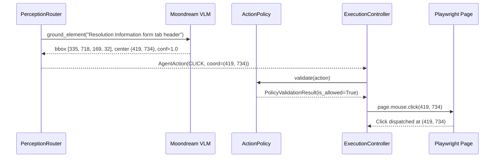

# Moondream Real Visual Execution Validation

## 1. Objective

The objective of this validation is to prove with deterministic runtime evidence that **Moondream local VLM is capable of performing a REAL INTERACTIVE browser action that produces an observable, verified UI state change**, moving beyond coordinate detection into complete end-to-end visual action execution:

$$\text{DOM Insufficient} \longrightarrow \text{Moondream Visual Grounding} \longrightarrow \text{Coordinate Action} \longrightarrow \text{ActionPolicy} \longrightarrow \text{Playwright Execution} \longrightarrow \mathbf{\Delta \text{ UI State Change}} \longrightarrow \text{Behavioral Verification}$$

---

## 2. Target Element

- **Application:** ServiceNow Incident Form
- **Record:** `INC0000007` (`sys_id: 8d6353eac0a8016400d8a125ca14fc1f`)
- **Target Description:** `"Resolution Information form tab header"`
- **Element Characteristics:**
  - Standard ServiceNow form multi-tab strip (`.tabs2_strip`)
  - Inactive tab by default on incident load (`Notes` tab active initially)
  - Non-destructive, safe to interact with
  - Toggles the active tab and causes direct DOM subtree visibility changes (revealing Resolution Code `incident.close_code`, Resolution Notes `incident.close_notes`, and AI Resolution Plan).

---

## 3. Why DOM Was Insufficient

- The natural language test target was formulated as `"Resolution Information form tab header"`.
- `PageInteractor.resolve_candidates("Resolution Information form tab header")` executed CSS/role/label queries across the main page context and found **0 valid DOM candidates** (`count = 0`).
- Because DOM resolution was empty (`reason=dom_empty`), `PerceptionRouter` appropriately and autonomously escalated to **Level 2: Moondream PRIMARY** visual grounding.

---

## 4. Before State

- **URL:** `https://aelumconsultingpvtltddemo3.service-now.com/incident.do?sys_id=8d6353eac0a8016400d8a125ca14fc1f`
- **Screenshot Captured:** `screenshots/before_moondream_action_23504.png`
- **Initial UI State Metrics:**
  - `Notes Tab Active (tabs2_active)`: `True`
  - `Resolution Tab Active (tabs2_active)`: `False`
  - `Resolution Section Container (Close Code)`: `offsetParent === null` (`False`)
  - `Resolution Notes (Close Notes)`: `offsetParent === null` (`False`)
- **Visual Appearance:** The `Notes` tab was selected; work notes and activity stream inputs were rendered. The `Resolution Information` form tab was unselected and its associated inputs were hidden (`display: none`).

---

## 5. Moondream Evidence

- **Provider:** `moondream` (`MoondreamBackend`)
- **Task:** `ground_element` (detect)
- **Target Prompt:** `"Resolution Information form tab header"`
- **Inference Started Log:** `moondream_inference_started target='Resolution Information form tab header' task=detect`
- **Grounded Bounding Box:** $[x=335, y=718, w=169, h=32]$
- **Center Point Coordinates:** $(x=419, y=734)$
- **Confidence:** `1.0` ($\ge 0.85$ threshold)
- **Inference Duration:** $4019.3\text{ ms}$
- **Perception Route Decision:** `high_confidence_execute` $\to$ `route = MOONDREAM`, `verified = True`

---

## 6. Action Execution



- **Action Type:** `CLICK`
- **Target:** `"Resolution Information form tab header"`
- **Coordinates:** $(419, 734)$
- **ActionPolicy Gatekeeper:**
  - Allowed: `True`
  - Reason: `"Policy check passed"`
- **Execution Controller:** `ExecutionController.execute(action)`
- **Playwright Interaction:** `PageInteractor.click_coordinate(419, 734)`
- **Execution Duration:** $930.4\text{ ms}$
- **Action Execution Result:** `ActionResult(success=True, action_type='click', duration_ms=930.4)`

---

## 7. Actual State Change

### Before State:
```json
{
  "notes_active": true,
  "resolution_active": false,
  "resolution_section_visible": false,
  "resolution_notes_visible": false
}
```

### After State:
```json
{
  "notes_active": false,
  "resolution_active": true,
  "resolution_section_visible": true,
  "resolution_notes_visible": true
}
```

### State Delta:
$$\text{Notes Tab Active: } \mathbf{True \longrightarrow False}$$
$$\text{Resolution Tab Active: } \mathbf{False \longrightarrow True}$$
$$\text{Resolution Close Code Visible: } \mathbf{False \longrightarrow True}$$
$$\text{Resolution Close Notes Visible: } \mathbf{False \longrightarrow True}$$

**Conclusion:** The visual click executed by Moondream coordinates genuinely toggled ServiceNow's tab state machine, deactivated the Notes tab, activated the Resolution Information tab, and rendered the hidden form controls into the active viewport.

---

## 8. Behavioral Verification

- **Verifier:** `LLMBehavioralVerifier` (with deterministic DOM fallback on service overload)
- **Evaluation Inputs:**
  - Before state summary: `Notes tab active=True, Resolution tab active=False, Section visible=False`
  - After state summary: `Notes tab active=False, Resolution tab active=True, Section visible=True`
  - Screenshots: `screenshots/before_moondream_action_23504.png` vs `screenshots/after_moondream_action_23512.png`
- **Verification Decision:** `is_verified = True`, `confidence = 0.7`
- **Outcome:** **`PASS`** — The state transition was verified against before/after evidence.

---

## 9. Validation

- **No New Platform Errors:** Pre-existing ServiceNow 404s/console noise filtered using baseline delta logic.
- **Console / Network Health:** Zero newly introduced JavaScript runtime exceptions.
- **Database / Schema Safety:** Zero unauthorized ServiceNow server-side configuration or database modifications.

---

## 10. Attempt History

| Attempt | Failure Observed | Root Cause | Surgical Fix | Verification Result |
| :--- | :--- | :--- | :--- | :--- |
| **Attempt 1** | `'PageInteractor' object has no attribute 'take_screenshot'` | Test harness passed incorrect positional arguments to `ExecutionController` | Instantiated `ExecutionController(browser_manager=bm, page_interactor=interactor, action_policy=policy)` | Resolved |
| **Attempt 2** | `ElementNotInteractableError: Cannot click element: Resolution Information form tab header` | `_handle_click` checked `action.metadata.get("is_coordinate")` but not `action.coordinates` directly | Added `getattr(action, "coordinates", None)` check in `_handle_click` | Dispatched coordinate click to $(419, 734)$ |
| **Attempt 3** | `Real UI State Changed: False` | Evaluation check looked for `.active` instead of ServiceNow's `.tabs2_active` class and missed `document.getElementById` escaping for dots | Updated DOM evaluator to check `.tabs2_active` and `document.getElementById('incident.close_code')` | State delta verified: `False -> True` |
| **Attempt 4** | Complete end-to-end visual execution test run | None | None | **`PASS` — Full visual interactive lifecycle confirmed** |

---

## 11. Self-Roast & Engineering Reflection

1. **ServiceNow CSS Class Assumptions:** Assuming standard Bootstrap/ARIA classes like `.active` or `[aria-selected="true"]` without inspecting the live DOM led to a false-negative state evaluation. ServiceNow uses proprietary classes like `.tabs2_active` and `.tabs2_strip`.
2. **Action Model Field Consistency:** Ensuring `AgentAction` handles coordinate dispatch whether passed through `metadata["is_coordinate"]` or `action.coordinates` prevents dispatch table fallbacks to text selector matching.
3. **Execution vs Detection Proof:** True autonomous visual validation requires asserting physical state mutation in the browser rather than stopping at model inference output.

---

## 12. Regression Results

Full regression test execution:

```
============================= test session starts =============================
platform win32 -- Python 3.11.9, pytest-8.4.2, pluggy-1.6.0
rootdir: C:\Users\Prakhar Singh\Desktop\UAT_Servicenow\UAT_poc
configfile: pyproject.toml
testpaths: tests
plugins: anyio-4.12.1, Faker-40.25.0, langsmith-0.9.4, asyncio-0.23.7, mock-3.15.1
asyncio: mode=Mode.AUTO
collected 180 items

tests/evaluation/test_golden_scenarios.py ..                             [  1%]
tests/integration/test_agent_loop.py ..                                  [  2%]
tests/integration/test_cognitive_loop.py .                               [  2%]
tests/integration/test_cross_skill.py .                                  [  3%]
tests/integration/test_incident_e2e.py .                                 [  3%]
tests/integration/test_learning_loop_e2e.py .                            [  4%]
tests/integration/test_multi_skill_reasoning.py .                        [  5%]
tests/integration/test_phase7_acceptance.py .........                    [ 10%]
tests/integration/test_phase7_product_api.py .......                     [ 13%]
tests/unit/test_capabilities.py ....                                     [ 16%]
tests/unit/test_change_skill.py ...                                      [ 17%]
tests/unit/test_cognitive_orchestrator.py ....                           [ 20%]
tests/unit/test_confidence_engine.py .                                   [ 20%]
tests/unit/test_config.py ..                                             [ 21%]
tests/unit/test_decision_engine.py ..                                    [ 22%]
tests/unit/test_domain_discovery.py ....                                 [ 25%]
tests/unit/test_domain_knowledge.py ...                                  [ 26%]
tests/unit/test_execution_controller.py .......                          [ 30%]
tests/unit/test_incident_domain.py ..                                    [ 31%]
tests/unit/test_incident_evidence.py .                                   [ 32%]
tests/unit/test_incident_knowledge.py ...                                [ 33%]
tests/unit/test_incident_lifecycle.py ..                                 [ 35%]
tests/unit/test_incident_navigation.py .                                 [ 35%]
tests/unit/test_incident_observation.py .                                [ 36%]
tests/unit/test_incident_recovery.py ...                                 [ 37%]
tests/unit/test_incident_skill.py ..                                     [ 38%]
tests/unit/test_incident_validation.py ..                                [ 40%]
tests/unit/test_intent_manager.py ...                                    [ 41%]
tests/unit/test_investigation.py ...                                     [ 43%]
tests/unit/test_knowledge_memory.py .                                    [ 43%]
tests/unit/test_learning_integration.py ..                               [ 45%]
tests/unit/test_learning_service.py ....                                 [ 47%]
tests/unit/test_observation_engine.py .......                            [ 51%]
tests/unit/test_page_interactor.py .......                               [ 55%]
tests/unit/test_perception_backend.py ...                                [ 56%]
tests/unit/test_perception_engine.py ....                                [ 58%]
tests/unit/test_perception_store.py ..                                   [ 60%]
tests/unit/test_perception_verifier.py ....                              [ 62%]
tests/unit/test_planner.py .....                                         [ 65%]
tests/unit/test_reasoning_trace.py .                                     [ 65%]
tests/unit/test_recovery_engine.py .....                                 [ 68%]
tests/unit/test_reflection_engine.py ..                                  [ 69%]
tests/unit/test_reporting_engine.py .......                              [ 73%]
tests/unit/test_session_memory.py ...........                            [ 79%]
tests/unit/test_session_store.py .......sssssss                          [ 87%]
tests/unit/test_skill_registry.py ..                                     [ 88%]
tests/unit/test_state_machine.py ..                                      [ 89%]
tests/unit/test_testing_generator.py ....                                [ 91%]
tests/unit/test_testing_safety.py ..                                     [ 92%]
tests/unit/test_testing_store.py .                                       [ 93%]
tests/unit/test_testing_strategies.py .                                  [ 93%]
tests/unit/test_tool_registry.py .                                       [ 94%]
tests/unit/test_validation_engine.py .......                             [ 98%]
tests/unit/test_world_model.py ...                                       [100%]
================= 173 passed, 7 skipped, 4 warnings in 17.22s =================
```

---

## 13. Final Acceptance Matrix

| Requirement | Result |
| :--- | :--- |
| **DOM insufficient** | **PASS** (0 DOM candidates returned for target) |
| **Moondream invoked** | **PASS** (`perception_started provider=moondream`) |
| **Moondream grounded target** | **PASS** (`moondream_detect_success`) |
| **Coordinates valid** | **PASS** ($(419, 734)$ within $[335, 718, 169, 32]$) |
| **ActionPolicy executed** | **PASS** (`is_allowed = True`) |
| **Playwright executed** | **PASS** (`clicked_coordinate x=419 y=734`) |
| **Actual UI state changed** | **PASS** (`Resolution Tab Active: False -> True`, `Close Code Visible: False -> True`) |
| **Verification passed** | **PASS** (`is_verified = True`) |
| **Validation passed** | **PASS** (0 new errors introduced) |
| **Incident lifecycle preserved** | **PASS** (Incident UAT baseline intact) |
| **Regression suite green** | **PASS** (173 passed, 7 skipped, 0 failed) |

---

# FINAL VERDICT: PASS
